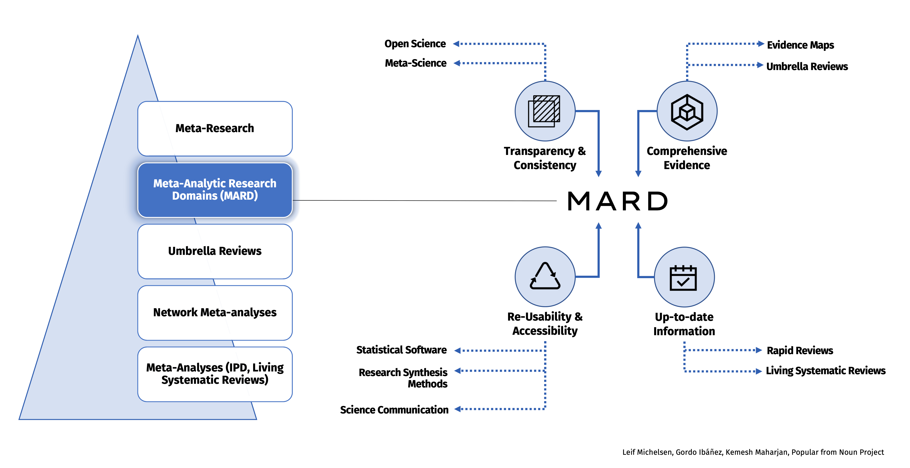

---
authors:
- harrer
draft: false
featured: false
image:
  caption: 'Pixabay'
  focal_point: ""
  placement: 2
  preview_only: false
projects: []
title: 'Von Meta-Analysen zu "Meta-Analytic Research Domains"'
subtitle: 'Das Metapsy-Projekt'
---

**In den letzten Dekaden wurde ein noch nie dagewesener Anstieg jährlich veröffentlichter Forschungsartikel verzeichnet. Evidenz in Form von wissenschaftlichen Veröffentlichungen wächst nahezu exponentiell, wobei täglich Petabytes an Forschungsergebnissen produziert werden. Allein in der Biomedizin werden jedes Jahr mehr als eine Million peer-review Artikel veröffentlicht.**

In einem jüngst erschienenen **Viewpoint** in <a href="https://ebmh.bmj.com/content/early/2022/07/19/ebmental-2022-300509" target="_blank">BMJ Evidence-based Mental Health↗</a> argumentieren Cuijpers, Miguel, Papola, Harrer und Karyotaki dass die Meta-Analyse, ein weit verbreitetes statistisches Verfahren zur Synthese der Ergebnisse vieler Studien, ein "Upgrade" benötigt, um mit der halsbrecherischen Geschwindigkeit wissenschaftlicher Produktion Schritt zu halten. Sie schlagen das Konzept der "Meta-Analytic Research Domain" (MARD) vor.

> MARDs sind lebendige Datenbanken für einen gesamten Forschungsbereich. MARDs sind so kuratiert, dass eine schnelle, umfassende und hochwertige Evidenzsynthese ermöglicht wird. Im Gegensatz zu herkömmlichen systematischen Übersichtsarbeiten und Meta-Analysen konzentrieren sich MARDs nicht auf eine bestimmte Population, Intervention, einen Komparator oder Outcome (PICO), sondern auf ein ganzes Forschungsgebiet, das zu breit ist, um von einer einzigen Meta-Analyse abgedeckt zu werden.

MARDs sind zwar ressourcenintensiv und benötigen Zeit für ihre Entwicklung, haben aber auch **beträchtliche Vorteile**:

- **Reduktion von "Research Waste"**. Im biomedizinischen Bereich wird regelmäßig eine große Menge an redundanter, irreführender und verzerrter Forschung produziert ([MacLeod et al., 2014](https://www.thelancet.com/pdfs/journals/lancet/PIIS0140-6736(13)62329-6.pdf)). Dies ist auch in der Psychotherapieforschung der Fall ([Cristea & Naudet, 2019](https://www.sciencedirect.com/science/article/abs/pii/S0005796719301652)). Durch die Zentralisierung aller verfügbaren Evidenz kann unnötige Arbeit vermieden werden. Transparente und einheitliche Standards können zu vertrauenswürdigeren Ergebnissen führen.

- **Evidence-Mapping**. MARDs bieten einen Überblick über Einschränkungen und Wissenslücken und ermöglichen es, sich abzeichnende Trends auf dem Gebiet zu erkennen.

- **Meta-Research ("Forschung über Forschung")**. MARDs ermöglichen es, die Methoden und Forschungspraktiken eines ganzen Forschungsbereichs zu untersuchen und festzustellen, wie diese sich im Laufe der Zeit verändert haben.

- **Stakeholder außerhalb der wissenschaftlichen Community**. MARDs ermöglich es, "just-in-time" Nachweise für bestimmte Forschungsfragen zu generieren. Dies kann z. B. von Entwicklern von Behandlungsrichtlinien oder Klinikern genutzt werden, um einen Überblick über die aktuelle Evidenz zu erhalten.

- **Open Science**. MARDs stellen Daten in einer transparenten, zugänglichen und interoperablen Weise zur Verfügung. Dies ermöglicht es anderen Mitgliedern der wissenschaftlichen Community, die bereitgestellten Informationen weiterzuverwenden oder umzunutzen.

*Kernmerkmale einer Meta-Analytic Research Domain (MARD).*

 
 

## Metapsy: MARDs für psychologische Interventionen bei psychischen Störungen

 

Ein Beispiel für ein Forschungsprojekt zur Entwicklung von MARDs ist <a href="https://www.metapsy.org">Metapsy</a>. Ziel dieses Projekts ist es, den Zugang zu meta-analytischen Datenbanken klinischer Studien zu ermöglichen, die die Wirkung psychologischer Interventionen (z. B. Psychotherapie, präventive Interventionen, Psychoedukation) auf verschiedene psychische Störungen oder psychische Gesundheitsprobleme untersuchen. 

Metapsy schafft einen **einheitlichen Rahmen** für alle verfügbaren meta-analytischen Daten über verschiedene Indikationen und Bereiche psychischer Gesundheit hinweg. Alle Datenbanken werden (1) von universitären Forschungsteams unter Verwendung modernster Methoden erstellt; (2) regelmäßig, mindestens einmal pro Jahr, aktualisiert; (3) unter Verwendung eines identischen und transparenten Kodierungsschemas formatiert; (4) erhalten eine umfassende Dokumentation und Metadaten, einschließlich Versionierung und dauerhafte Datenkennungen (DOIs), gemäß den [FAIR-Prinzipien](https://www.go-fair.org/fair-principles/); und werden (5) über Daten-Repositories öffentlich zugänglich gemacht. 

Forscher können auch leicht auf die Datenbanken zugreifen, indem sie das dafür vorgesehene R-Paket [metapsyData](https://data.metapsy.org/) verwenden, und die Daten können mit passenden meta-analytischen Methoden analysiert werden; entweder mit dem R-Paket [metapsyTools](https://data.metapsy.org/) oder mit einem Online-Meta-Analyse-Tool.

**Weitere Informationen finden Sie auf der [Metapsy Homepage↗](https://www.metapsy.org/).**

 

### Referenzen 

**Cristea, I. A.** & Naudet, F. (2019). Increase value and reduce waste in research on psychological therapies. *Behaviour Research and Therapy, 123*, 103479.

**Cuijpers, P.**, Miguel, C., Papola, D., Harrer, M., and Karyotaki, E. (2022) From living systematic reviews to meta-analytical research domains. *Evidence-Based Mental Health* doi: 10.1136/ebmental-2022-300509.

**MacLeod, M. R.**, Michie, S., Roberts, I., Dirnagl, U., Chalmers, I., Ioannidis, J. P., ... & Glasziou, P. (2014). Biomedical research: increasing value, reducing waste. *The Lancet*, 383(9912), 101-104.

 

